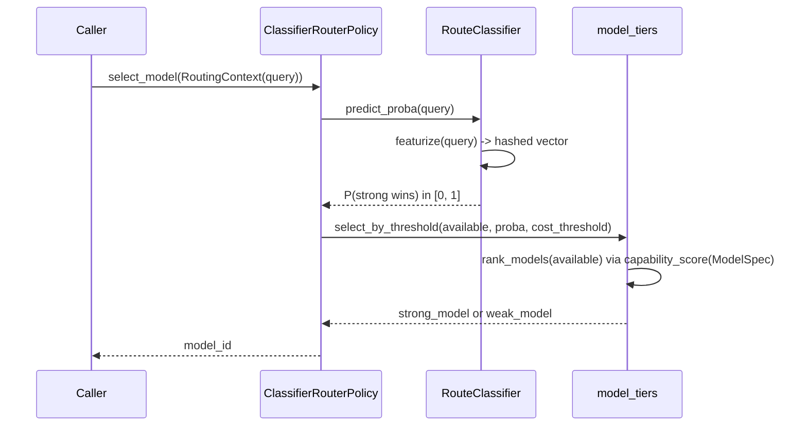

# Routing layer — architecture

## Layout

```
src/openjarvis/learning/routing/
├── feature_extraction.py   # shared, dependency-free text -> vector featurizer
├── model_tiers.py          # decoupled model tiering (Feature 4)
├── classifier.py           # RouteClassifier + ClassifierRouterPolicy (Feature 1)
├── similarity_router.py    # SimilarityRouterPolicy (Feature 3, 3rd strategy)
├── training.py             # bootstrap_dataset / retrain / fine_tune (Feature 5)
├── router.py                (pre-existing) HeuristicRouter — rule-based strategy
├── learned_router.py         (pre-existing) LearnedRouterPolicy — online trace-driven
├── complexity.py             (pre-existing) score_complexity — heuristic query scorer
├── heuristic_reward.py       (pre-existing) HeuristicRewardFunction
├── _utils.py                 (pre-existing) classify_query
└── __init__.py              # registers all strategies + create_router_policy() factory
```

## Component diagram

```mermaid
flowchart TB
    subgraph Config["Config surface (Feature 2 — cost dial)"]
        TOML["configs/openjarvis/config.toml\n[learning.routing]"]
        API["PUT /v1/learning/routing/config\n(api_routes.py)"]
        CLI["jarvis config set\nlearning.routing.*"]
    end

    TOML --> RLC["RoutingLearningConfig\n(core/config.py)"]
    API --> TOML
    CLI --> TOML
    RLC -->|policy, cost_threshold,\nmin_samples, similarity_k| Factory

    subgraph Registry["RouterPolicyRegistry (Feature 3 — swappable strategies)"]
        Factory["create_router_policy(strategy, **kwargs)"]
        Factory --> Heuristic["\"heuristic\"\nHeuristicRouter\n(rule-based)"]
        Factory --> Learned["\"learned\"\nLearnedRouterPolicy\n(online, trace-driven)"]
        Factory --> Classifier["\"classifier\"\nClassifierRouterPolicy\n(trained)"]
        Factory --> Similarity["\"similarity\"\nSimilarityRouterPolicy\n(k-NN exemplars)"]
    end

    subgraph FeatExt["feature_extraction.py"]
        Featurize["featurize(query)\nhashed n-grams + complexity signals"]
    end
    Classifier --> Featurize
    Similarity --> Featurize

    subgraph Tiers["model_tiers.py (Feature 4 — decoupled, any model)"]
        Tier["capability_score(ModelSpec)\nrank_models() / select_by_threshold()"]
    end
    Classifier --> Tier
    Registry -.reads.-> ModelRegistry[("ModelRegistry\n(local GGUF + cloud, any provider)")]
    Tier --> ModelRegistry

    subgraph Train["training.py (Feature 5 — recalibration)"]
        Bootstrap["bootstrap_dataset()\nheuristic-distilled, cold start"]
        FromTraces["build_dataset_from_traces()\nreal usage data"]
        Retrain["retrain() / fine_tune()"]
        Bootstrap --> Retrain
        FromTraces --> Retrain
        Retrain --> ClassifierModel[("RouteClassifier\nweights.json")]
    end
    TraceStore[("TraceStore\n(traces.db)")] --> FromTraces
    ClassifierModel --> Classifier

    Query["RoutingContext (query)"] --> Registry
    Registry --> Selected["selected model_id"]
```

## Request flow (classifier strategy)



## Feature-to-code map

| Feature (from the upgrade brief) | Implementation |
|---|---|
| 1. Trained classifier, not keyword rules | `classifier.RouteClassifier` — hashed-feature logistic regression (`"simple"` backend, zero deps) or `sklearn.linear_model.LogisticRegression` (`"sklearn"` backend, optional extra), both exported to the same plain-float `(weights, bias)` form. |
| 2. Configurable cost threshold dial | `RoutingLearningConfig.cost_threshold` in `configs/openjarvis/config.toml` `[learning.routing]`; `GET`/`PUT /v1/learning/routing/config` in `api_routes.py`; `ClassifierRouterPolicy.set_cost_threshold()` at runtime. |
| 3. Swappable routing strategies | `RouterPolicyRegistry` — `"heuristic"`, `"learned"`, `"classifier"`, `"similarity"` all self-register; `create_router_policy(strategy, **kwargs)` factory. |
| 4. Decoupled, any model (local/cloud) | `model_tiers.py` reads only `ModelSpec` metadata already in `ModelRegistry` (parameter count for local/open models, `pricing_output` for proprietary cloud models) — no model names hardcoded anywhere in the routing strategies. |
| 5. Recalibration/retraining | `training.py` — `bootstrap_dataset()` for cold start (heuristic-distilled, no LLM calls), `build_dataset_from_traces()` for real usage data, `retrain()` / `fine_tune()` (warm-started incremental) with JSON persistence via `RouteClassifier.save()`/`.load()`. |

## Why "decoupled, works with any model" holds up

Every routing strategy in this module accepts `available_models: List[str]`
(plain string keys) and, if omitted, falls back to
`ModelRegistry.keys()` — the same registry
`intelligence.model_catalog.register_builtin_models()` populates with ~40
built-in models (local GGUF/MoE models spanning 0.8B–397B params, and
proprietary cloud models from OpenAI/Anthropic/Google/MiniMax with real
per-token pricing) and that `intelligence.model_catalog.merge_discovered_models()`
extends at runtime with models discovered from a live engine (e.g. an
Ollama server's installed model list). Nothing in `classifier.py`,
`similarity_router.py`, or `model_tiers.py` special-cases a provider,
engine, or specific model name — `capability_score()` is the only place
that reads model metadata, and it degrades gracefully (falls back to
pricing, then to `0.0`) for models it doesn't recognize rather than
raising. This was verified directly (not just by code inspection) against
a mixed local+cloud model set:

```python
>>> from openjarvis.learning.routing.model_tiers import tier_models
>>> tier_models(["llama3.2:3b", "llama3.3:70b", "gpt-4o", "gpt-4o-mini"])
ModelTiers(weak='gpt-4o-mini', strong='llama3.3:70b',
           ranked=['gpt-4o-mini', 'llama3.2:3b', 'gpt-4o', 'llama3.3:70b'])
```

Note the ranking interleaves local and cloud models purely by capability
proxy — `gpt-4o-mini` (a cloud model, ranked by price) lands below the
mid-size local `llama3.2:3b`, and the local `llama3.3:70b` outranks
`gpt-4o` — there's no local-models-first or cloud-models-first bias built
in anywhere.

## Known limitations (documented, not hidden)

- **`similarity` strategy is lexical, not semantic.** Cosine similarity
  runs over hashed word/character-trigram features, not embeddings — it
  matches shared vocabulary, not paraphrases. It also needs a
  *reasonably-sized, textually varied* exemplar set: a handful of
  one-word exemplars (e.g. bare `"Hi"`) can be outvoted by unrelated
  longer exemplars purely from hash-collision noise, which is why
  `SimilarityRouterPolicy` uses a wider default hash space (256, vs. the
  classifier's 64) and a `min_similarity` floor that drops near-zero
  matches from voting rather than trusting the noise. For real semantic
  similarity, plug in `sentence-transformers` (already an optional extra
  in this project, `memory-faiss`) as an alternate vector source — a
  documented extension point, not implemented here.
- **The classifier's default `"simple"` backend is a linear model.**
  RouteLLM's `bert`/`causal_llm` routers outperform their own `mf`
  (matrix-factorization, also linear) router — this project's default
  backend is architecturally closest to `mf`. See `RESEARCH.md` for why a
  transformer-backed router isn't the shipped default.
- **`build_dataset_from_traces()` labels are a proxy, not true preference
  pairs.** RouteLLM trains on real strong-vs-weak comparisons on the same
  query; this codebase's `TraceStore` only records one model's outcome
  per query. See the docstring in `training.py` for the exact labeling
  rule and its justification.
